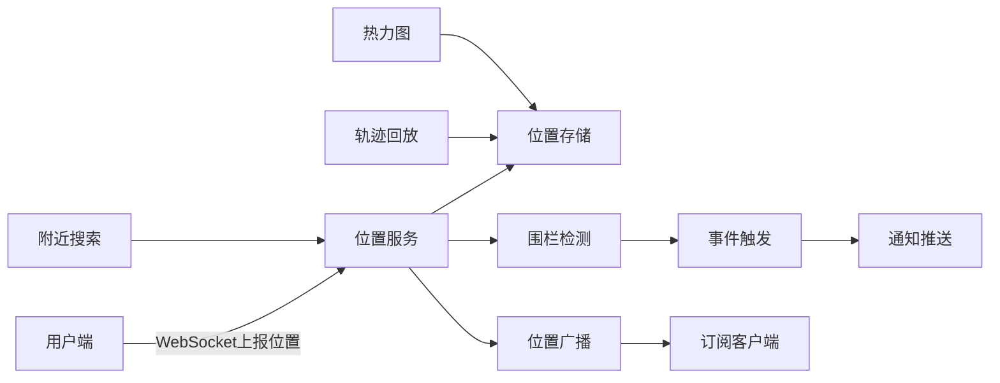

## 1. 产品概述

地理位置服务应用是一个集实时位置追踪、附近搜索、地理围栏、轨迹回放和热力图展示于一体的综合性位置服务平台。面向需要位置感知能力的应用场景，提供高性能的位置数据处理和可视化能力。

- 核心价值：提供毫秒级位置上报、精准地理查询、智能围栏预警和丰富的位置数据可视化
- 目标用户：开发者、运营人员、物流调度、位置服务业务方

## 2. 核心功能

### 2.1 用户角色

| 角色 | 注册方式 | 核心权限 |
|------|----------|----------|
| 普通用户 | 模拟登录 | 查看地图、上报位置、搜索附近、查看围栏 |
| 管理员 | 模拟登录 | 围栏管理、数据统计、热力图查看、轨迹回放 |

### 2.2 功能模块

1. **实时位置模块**：WebSocket位置上报、位置广播订阅、在线用户展示
2. **附近搜索模块**：按距离范围筛选、按类别筛选、距离排序、实时距离显示
3. **地理围栏模块**：圆形围栏绘制、多边形围栏绘制、进入/离开事件、事件通知
4. **轨迹回放模块**：时间轴展示、播放控制、速度调节、轨迹路线绘制
5. **热力图模块**：坐标点聚合、密度分布展示、颜色梯度渲染

### 2.3 页面详情

| 页面名称 | 模块名称 | 功能描述 |
|----------|----------|----------|
| 实时地图页 | 地图主视图 | 显示所有在线用户/商家位置，支持缩放拖拽 |
| 实时地图页 | 位置上报 | 模拟位置上报或获取真实位置，WebSocket实时同步 |
| 实时地图页 | 在线列表 | 显示当前在线用户列表及其实时距离 |
| 附近搜索页 | 搜索筛选 | 距离范围滑块、类别多选筛选 |
| 附近搜索页 | 结果列表 | 按距离排序的结果列表，显示实时距离 |
| 围栏管理页 | 围栏列表 | 已创建围栏的列表展示和管理 |
| 围栏管理页 | 围栏绘制 | 可视化绘制圆形和多边形围栏 |
| 围栏管理页 | 事件日志 | 围栏触发事件记录和通知 |
| 轨迹回放页 | 时间轴 | 可拖动的时间轴，标记关键时间点 |
| 轨迹回放页 | 播放控制 | 播放/暂停、速度调节（0.5x~4x） |
| 热力图页 | 热力渲染 | 基于坐标点密度的热力图展示 |
| 热力图页 | 数据统计 | 区域密度统计和排名 |

## 3. 核心流程

### 3.1 位置上报与广播流程
用户端通过WebSocket连接服务端，持续上报位置坐标；服务端更新用户最新位置，并广播给订阅该用户位置的其他客户端。

### 3.2 附近搜索流程
用户设置搜索半径和类别筛选条件，服务端基于Haversine公式计算距离，返回按距离排序的结果列表。

### 3.3 围栏事件触发流程
用户位置上报时，服务端检查该用户与所有围栏的空间关系，当进入或离开围栏时触发预设动作（推送通知、记录事件日志）。

### 3.4 轨迹回放流程
从数据库读取用户历史轨迹点，按时间排序后在前端通过时间轴控制回放，支持调节播放速度。

## 4. 用户界面设计

### 4.1 设计风格

- **主色调**：深邃蓝色系 (#0ea5e9 主色 / #0284c7 深色)，传达科技感和专业感
- **辅助色**：琥珀橙 (#f59e0b) 用于强调和警告，翠绿 (#10b981) 用于成功状态
- **背景**：深色主题，深蓝灰色背景 (#0f172a / #1e293b)，配合微光渐变
- **字体**：现代无衬线字体，标题使用几何感强的字体，正文清晰易读
- **按钮风格**：圆角胶囊型按钮，带有微妙的发光效果和悬浮动画
- **卡片风格**：半透明玻璃态效果，模糊背景，细边框，柔和阴影
- **图标风格**：线性简洁图标，配合主题色填充变化

### 4.2 页面设计概览

| 页面名称 | 模块名称 | UI元素 |
|----------|----------|--------|
| 实时地图页 | 顶部导航 | 品牌Logo、功能导航标签、用户状态指示 |
| 实时地图页 | 地图画布 | 全屏地图、用户标记动画、位置脉冲效果 |
| 实时地图页 | 侧边面板 | 在线用户列表、距离显示、连接状态 |
| 附近搜索页 | 筛选区域 | 距离滑块、类别标签、搜索按钮 |
| 附近搜索页 | 结果列表 | 卡片式列表、距离徽章、方向指示 |
| 围栏管理页 | 工具栏 | 绘制工具切换、围栏类型选择 |
| 围栏管理页 | 围栏列表 | 折叠面板、开关控制、颜色标识 |
| 轨迹回放页 | 控制条 | 播放按钮、速度选择、时间显示 |
| 轨迹回放页 | 时间轴 | 可拖动进度条、关键帧标记 |
| 热力图页 | 热力图层 | 渐变色彩、透明度调节 |
| 热力图页 | 统计面板 | 密度排名、区域统计 |

### 4.3 响应式

- 桌面端为主设计，侧边栏与地图并排布局
- 移动端侧边栏转为底部抽屉式面板
- 地图始终占据主要视觉区域，控制面板浮于地图之上
- 触摸优化：增大点击热区，支持手势缩放

### 4.4 动效设计

- 位置上报时标记点有脉冲扩散动画
- 围栏触发时有闪烁警示效果
- 轨迹回放有平滑的位置过渡动画
- 面板切换使用滑动和淡入淡出效果
- 数据加载有骨架屏和脉冲占位动画
