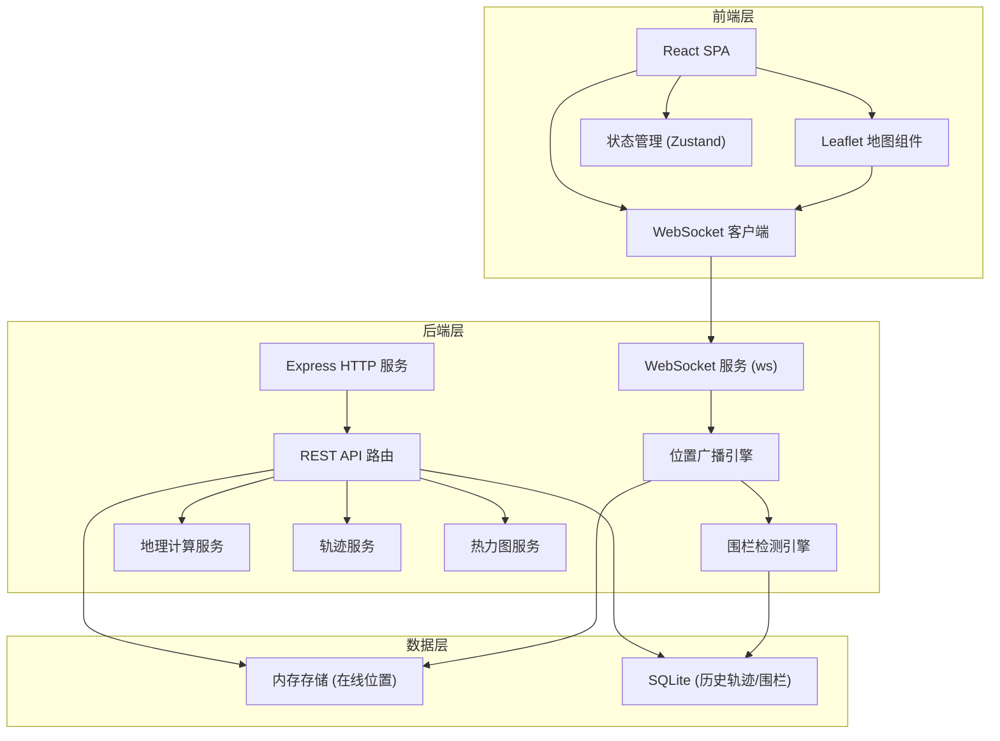
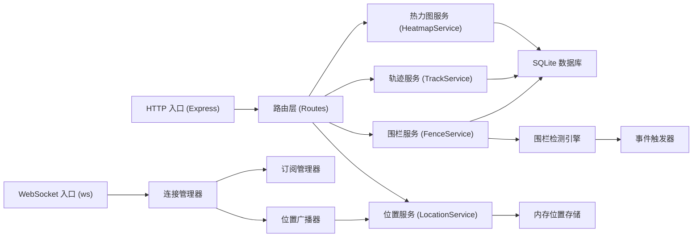
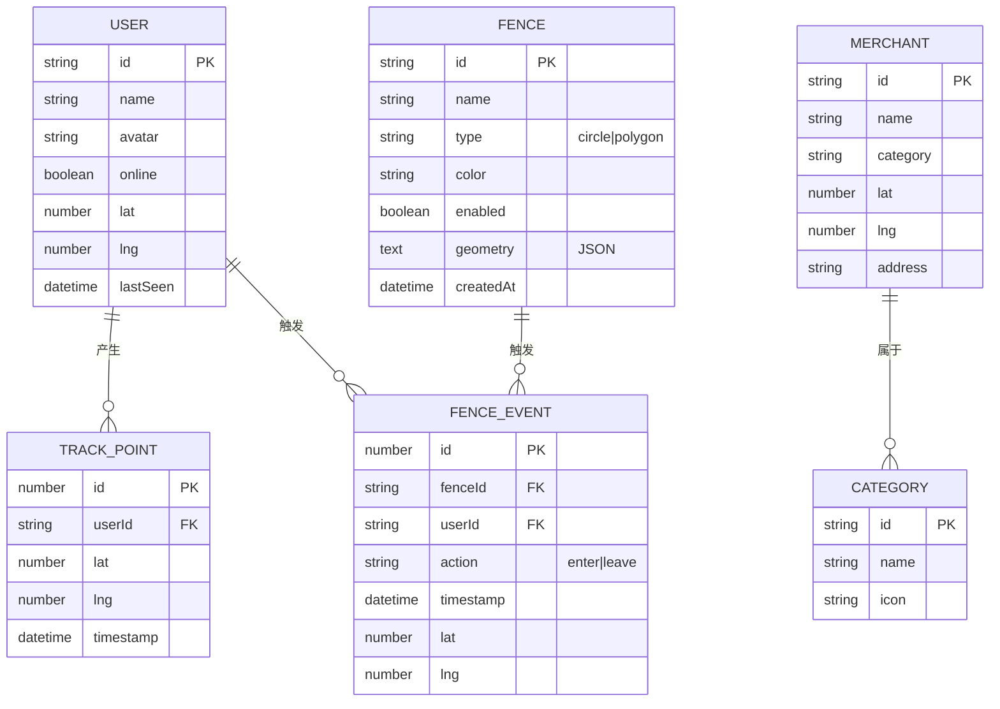

## 1. 架构设计



## 2. 技术描述

- **前端框架**: React 18 + TypeScript + Vite
- **样式方案**: TailwindCSS 3
- **状态管理**: Zustand
- **路由**: React Router DOM
- **地图引擎**: Leaflet + react-leaflet
- **WebSocket**: ws (客户端原生 WebSocket)
- **图标库**: lucide-react
- **后端框架**: Express 4 + TypeScript
- **WebSocket 服务**: ws
- **数据库**: SQLite + better-sqlite3
- **地理计算**: 内置 Haversine 公式 + 射线法多边形判断

## 3. 路由定义

| 路由路径 | 页面名称 | 功能描述 |
|----------|----------|----------|
| / | 实时地图页 | 主页面，展示实时位置和在线用户 |
| /nearby | 附近搜索页 | 搜索附近的用户和商家 |
| /fences | 围栏管理页 | 创建和管理地理围栏 |
| /track | 轨迹回放页 | 历史轨迹回放和时间轴控制 |
| /heatmap | 热力图页 | 位置密度热力图展示 |

## 4. API 定义

### 4.1 WebSocket 消息协议

```typescript
// 客户端 -> 服务端
interface PositionReport {
  type: 'position:report';
  userId: string;
  lat: number;
  lng: number;
  timestamp: number;
}

interface SubscribeUser {
  type: 'subscribe:user';
  userId: string;
}

interface UnsubscribeUser {
  type: 'unsubscribe:user';
  userId: string;
}

// 服务端 -> 客户端
interface PositionUpdate {
  type: 'position:update';
  userId: string;
  lat: number;
  lng: number;
  timestamp: number;
}

interface FenceEvent {
  type: 'fence:event';
  fenceId: string;
  fenceName: string;
  userId: string;
  action: 'enter' | 'leave';
  timestamp: number;
}

interface OnlineUsers {
  type: 'online:users';
  users: { userId: string; lat: number; lng: number }[];
}
```

### 4.2 REST API 接口

```typescript
// 附近搜索
GET /api/nearby?lat={lat}&lng={lng}&radius={radius}&category={category}
Response: {
  items: {
    id: string;
    name: string;
    type: 'user' | 'merchant';
    category?: string;
    lat: number;
    lng: number;
    distance: number; // 米
  }[];
}

// 围栏 CRUD
GET /api/fences
POST /api/fences
PUT /api/fences/:id
DELETE /api/fences/:id

// 围栏事件
GET /api/fences/events?limit=50

// 轨迹
GET /api/tracks/:userId?startTime={ts}&endTime={ts}
Response: {
  points: { lat: number; lng: number; timestamp: number }[];
}

// 热力图数据
GET /api/heatmap?startTime={ts}&endTime={ts}
Response: {
  points: { lat: number; lng: number; weight: number }[];
}

// 模拟用户/商家数据
GET /api/mock/users
GET /api/mock/merchants
```

## 5. 服务端架构图



## 6. 数据模型

### 6.1 数据模型定义



### 6.2 数据定义语言

```sql
-- 用户表
CREATE TABLE IF NOT EXISTS users (
  id TEXT PRIMARY KEY,
  name TEXT NOT NULL,
  avatar TEXT,
  online INTEGER DEFAULT 0,
  lat REAL,
  lng REAL,
  last_seen INTEGER
);

-- 轨迹点表
CREATE TABLE IF NOT EXISTS track_points (
  id INTEGER PRIMARY KEY AUTOINCREMENT,
  user_id TEXT NOT NULL,
  lat REAL NOT NULL,
  lng REAL NOT NULL,
  timestamp INTEGER NOT NULL,
  FOREIGN KEY (user_id) REFERENCES users(id)
);

CREATE INDEX idx_track_points_user_time ON track_points(user_id, timestamp);

-- 围栏表
CREATE TABLE IF NOT EXISTS fences (
  id TEXT PRIMARY KEY,
  name TEXT NOT NULL,
  type TEXT NOT NULL CHECK(type IN ('circle', 'polygon')),
  color TEXT DEFAULT '#0ea5e9',
  enabled INTEGER DEFAULT 1,
  geometry TEXT NOT NULL,
  created_at INTEGER NOT NULL
);

-- 围栏事件表
CREATE TABLE IF NOT EXISTS fence_events (
  id INTEGER PRIMARY KEY AUTOINCREMENT,
  fence_id TEXT NOT NULL,
  user_id TEXT NOT NULL,
  action TEXT NOT NULL CHECK(action IN ('enter', 'leave')),
  timestamp INTEGER NOT NULL,
  lat REAL NOT NULL,
  lng REAL NOT NULL,
  FOREIGN KEY (fence_id) REFERENCES fences(id)
);

CREATE INDEX idx_fence_events_time ON fence_events(timestamp DESC);

-- 商家表
CREATE TABLE IF NOT EXISTS merchants (
  id TEXT PRIMARY KEY,
  name TEXT NOT NULL,
  category TEXT NOT NULL,
  lat REAL NOT NULL,
  lng REAL NOT NULL,
  address TEXT
);

-- 类别表
CREATE TABLE IF NOT EXISTS categories (
  id TEXT PRIMARY KEY,
  name TEXT NOT NULL,
  icon TEXT
);

-- 初始数据
INSERT OR IGNORE INTO categories (id, name, icon) VALUES
('restaurant', '餐厅', 'utensils'),
('cafe', '咖啡店', 'coffee'),
('shop', '商店', 'shopping-bag'),
('park', '公园', 'tree-pine'),
('station', '车站', 'train'),
('hospital', '医院', 'hospital');
```
